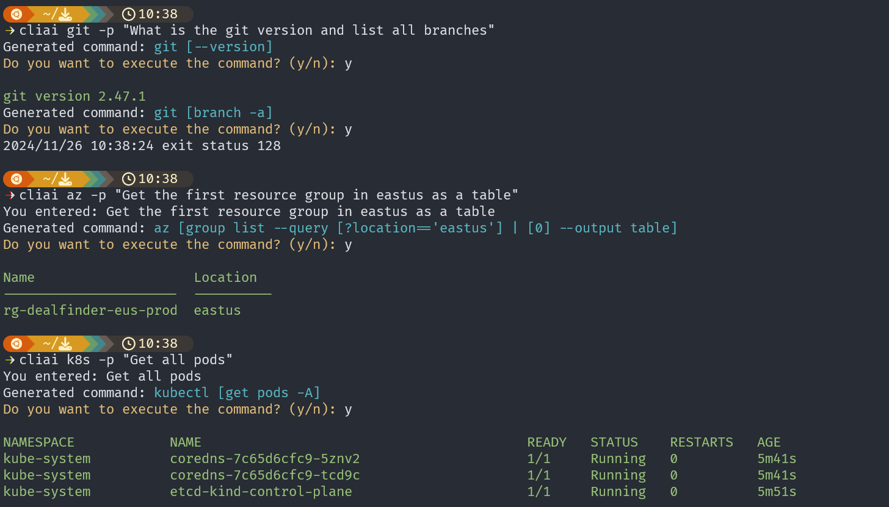

# cliai - CLI AI Commander

A utility written in Go to take natural language commands, generate git, Azure CLI and kubernetes commands, and execute them.

## Snapshot

## Usage

- Git CLI (Git compound command):
  - `cliai git -p "What is the git version and list all branches"`

- Azure CLI
  - `cliai az -p "Get the first resource group in eastus as a table"`

- kubectl CLI
  - `cliai k -p "Get the all pods in all namespaces"`

- Scaffold
  - `cliai sc -p "Generate a Python FAST API to manage customer"`

- Refactor
  - `cliai re -f app.py -o app_new.app`